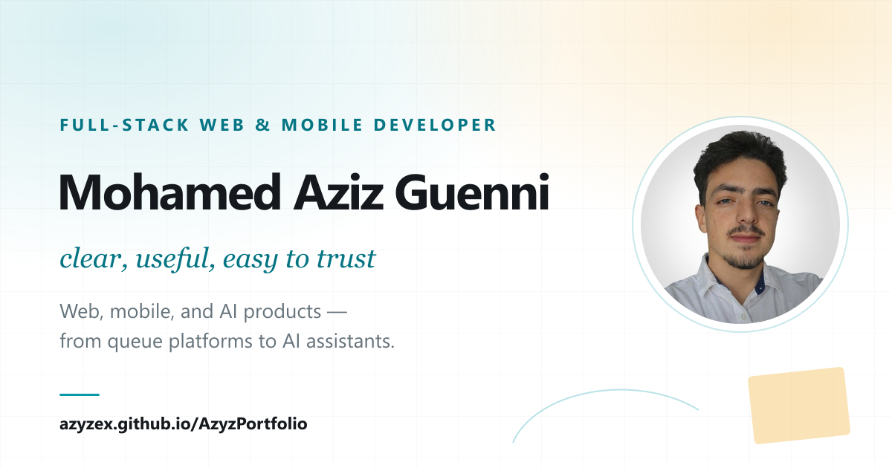

# Mohamed Aziz Guenni — Portfolio

Personal portfolio built with React, Vite, TypeScript and framer-motion, styled
with hand-written CSS. Live at <https://azyzex.github.io/AzyzPortfolio/>.



## Run locally

```bash
npm install
npm run dev
```

## Build

```bash
npm run build     # outputs dist/
npm run preview   # serve the build at /AzyzPortfolio/
```

Pushing to `main` deploys to GitHub Pages through
`.github/workflows/deploy.yml` (Pages source: GitHub Actions).

## Editing content

Almost everything on the site — profile, projects, certificates,
recommendations, the CV link, the course — lives in `src/data/portfolio.ts`.

- **New image:** drop the PNG/JPG into its folder under `public/assets/`, run
  `npm run optimize:images`, and reference the printed `.webp` path.
- **Project video:** add `<slug>-preview.webm` and `<slug>-preview.mp4` to the
  project's folder and set `video` (path without extension). See `CLAUDE.md`
  for the ffmpeg commands.
- **Share card:** `npm run generate:og` after changing the name, title or photo.
- **Contact form delivery:** set `VITE_FORMSPREE_ENDPOINT` in a local `.env`
  (see `.env.example`). Without it the form opens the visitor's mail client.
